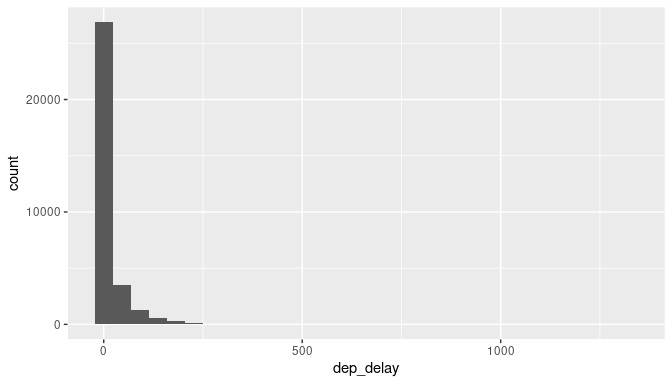
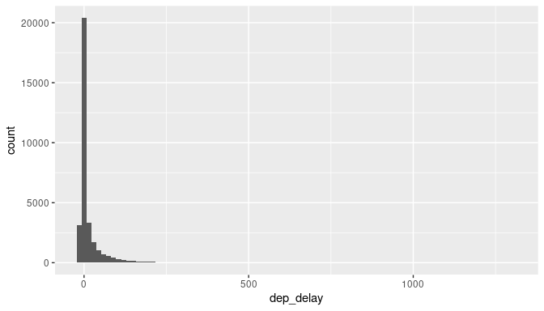
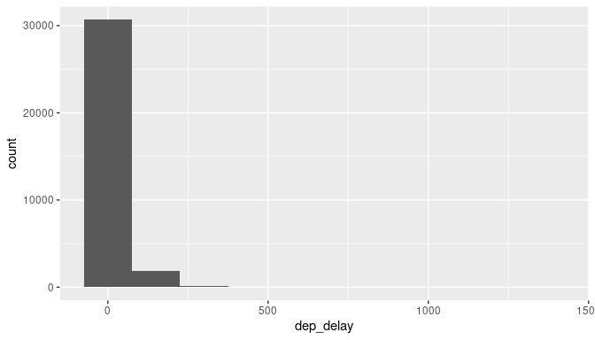
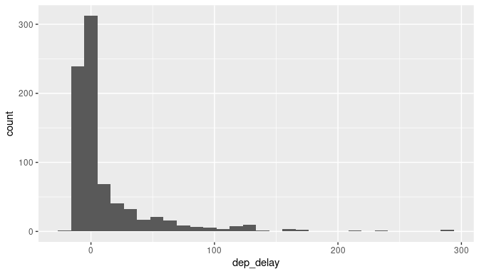
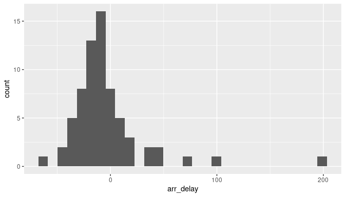
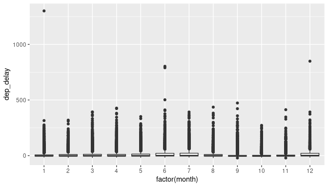
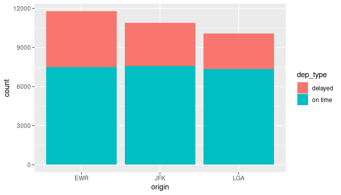
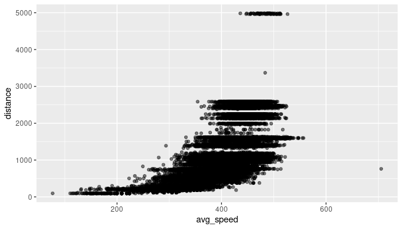

<div class="instructions">
Complete all **Exercises**, and submit answers to **Questions** on the Coursera 
platform.
</div>

## Introduction

Some define statistics as the field that focuses on turning information into
knowledge. The first step in that process is to summarize and describe the raw
information - the data. In this lab we explore flights, specifically a random
sample of domestic flights that departed from the three major 
New York City airport in 2013. We will generate simple graphical and numerical 
summaries of data on these flights and explore delay times. As this is a large 
data set, along the way you'll also learn the indispensable skills of data 
processing and subsetting.

## Getting started

### Load packages

In this lab we will explore the data using the `dplyr` package and visualize it 
using the `ggplot2` package for data visualization. The data can be found in the
companion package for this course, `statsr`.

Let's load the packages.


```r
library(statsr)
library(dplyr)
library(ggplot2)
```

### Data

The [Bureau of Transportation Statistics](http://www.rita.dot.gov/bts/about/) 
(BTS) is a statistical agency that is a part of the Research and Innovative 
Technology Administration (RITA). As its name implies, BTS collects and makes 
available transportation data, such as the flights data we will be working with 
in this lab.

We begin by loading the `nycflights` data frame. Type the following in your console
to load the data:


```r
data(nycflights)
```

The data frame containing 32735 flights that shows up in your 
workspace is a *data matrix*, with each row representing an *observation* and each 
column representing a *variable*. R calls this data format a **data frame**, which is 
a term that will be used throughout the labs.

To view the names of the variables, type the command


```r
names(nycflights)
```

```
##  [1] "year"      "month"     "day"       "dep_time"  "dep_delay" "arr_time" 
##  [7] "arr_delay" "carrier"   "tailnum"   "flight"    "origin"    "dest"     
## [13] "air_time"  "distance"  "hour"      "minute"
```

This returns the names of the variables in this data frame. The **codebook**
(description of the variables) is included below. This information can also be
found in the help file for the data frame which can be accessed by typing
`?nycflights` in the console.

- `year`, `month`, `day`: Date of departure
- `dep_time`, `arr_time`: Departure and arrival times, local timezone.
- `dep_delay`, `arr_delay`: Departure and arrival delays, in minutes. Negative times represent early departures/arrivals.
- `carrier`: Two letter carrier abbreviation.
    + `9E`:           Endeavor Air Inc.
    + `AA`:      American Airlines Inc.
    + `AS`:        Alaska Airlines Inc.
    + `B6`:             JetBlue Airways
    + `DL`:        Delta Air Lines Inc.
    + `EV`:    ExpressJet Airlines Inc.
    + `F9`:      Frontier Airlines Inc.
    + `FL`: AirTran Airways Corporation
    + `HA`:      Hawaiian Airlines Inc.
    + `MQ`:                   Envoy Air
    + `OO`:       SkyWest Airlines Inc.
    + `UA`:       United Air Lines Inc.
    + `US`:             US Airways Inc.
    + `VX`:              Virgin America
    + `WN`:      Southwest Airlines Co.
    + `YV`:          Mesa Airlines Inc.
- `tailnum`: Plane tail number
- `flight`: Flight number
- `origin`, `dest`: Airport codes for origin and destination. (Google can help
you with what code stands for which airport.)
- `air_time`: Amount of time spent in the air, in minutes.
- `distance`: Distance flown, in miles.
- `hour`, `minute`: Time of departure broken in to hour and minutes.

A very useful function for taking a quick peek at your data frame, and viewing
its dimensions and data types is `str`, which stands for **str**ucture.


```r
str(nycflights)
```

```
## tibble [32,735 × 16] (S3: tbl_df/data.frame)
##  $ year     : int [1:32735] 2013 2013 2013 2013 2013 2013 2013 2013 2013 2013 ...
##  $ month    : int [1:32735] 6 5 12 5 7 1 12 8 9 4 ...
##  $ day      : int [1:32735] 30 7 8 14 21 1 9 13 26 30 ...
##  $ dep_time : int [1:32735] 940 1657 859 1841 1102 1817 1259 1920 725 1323 ...
##  $ dep_delay: num [1:32735] 15 -3 -1 -4 -3 -3 14 85 -10 62 ...
##  $ arr_time : int [1:32735] 1216 2104 1238 2122 1230 2008 1617 2032 1027 1549 ...
##  $ arr_delay: num [1:32735] -4 10 11 -34 -8 3 22 71 -8 60 ...
##  $ carrier  : chr [1:32735] "VX" "DL" "DL" "DL" ...
##  $ tailnum  : chr [1:32735] "N626VA" "N3760C" "N712TW" "N914DL" ...
##  $ flight   : int [1:32735] 407 329 422 2391 3652 353 1428 1407 2279 4162 ...
##  $ origin   : chr [1:32735] "JFK" "JFK" "JFK" "JFK" ...
##  $ dest     : chr [1:32735] "LAX" "SJU" "LAX" "TPA" ...
##  $ air_time : num [1:32735] 313 216 376 135 50 138 240 48 148 110 ...
##  $ distance : num [1:32735] 2475 1598 2475 1005 296 ...
##  $ hour     : num [1:32735] 9 16 8 18 11 18 12 19 7 13 ...
##  $ minute   : num [1:32735] 40 57 59 41 2 17 59 20 25 23 ...
```

The `nycflights` data frame is a massive trove of information. Let's think about 
some questions we might want to answer with these data:

- We might want to find out how delayed flights headed to a particular 
destination tend to be. 
- We might want to evaluate how departure delays vary over months. 
- Or we might want to determine which of the three major NYC airports has a better 
on time percentage for departing flights.

### Seven verbs

The `dplyr` package offers seven verbs (functions) for basic data 
manipulation:

- `filter()`
- `arrange()`
- `select()` 
- `distinct()`
- `mutate()`
- `summarise()`
- `sample_n()`

We will use some of these functions in this lab, and learn about others in a 
future lab.


## Analysis

### Departure delays in flights to Raleigh-Durham (RDU)

We can examine the distribution of departure delays of all flights with a 
histogram.


```r
ggplot(data = nycflights, aes(x = dep_delay)) +
  geom_histogram()
```

```
## `stat_bin()` using `bins = 30`. Pick better value with `binwidth`.
```

<!-- -->

This function says to plot the `dep_delay` variable from the `nycflights` data 
frame on the x-axis. It also defines a `geom` (short for geometric object), 
which describes the type of plot you will produce. 

Histograms are generally a very good way to see the shape of a single 
distribution, but that shape can change depending on how the data is split 
between the different bins. You can easily define the binwidth you want to use:


```r
ggplot(data = nycflights, aes(x = dep_delay)) +
  geom_histogram(binwidth = 15)
```

<!-- -->

```r
ggplot(data = nycflights, aes(x = dep_delay)) +
  geom_histogram(binwidth = 150)
```

<!-- -->

<div class="exercise">
How do these three histograms with the various binwidths compare?
</div>

If we want to focus on departure delays of flights headed to RDU only, we need to
first `filter` the data for flights headed to RDU (`dest == "RDU"`) and then make
a histogram of only departure delays of only those flights.


```r
rdu_flights <- nycflights %>%
  filter(dest == "RDU")
ggplot(data = rdu_flights, aes(x = dep_delay)) +
  geom_histogram()
```

```
## `stat_bin()` using `bins = 30`. Pick better value with `binwidth`.
```

<!-- -->

Let's decipher these three lines of code:

- Line 1: Take the `nycflights` data frame, `filter` for flights headed to RDU, and 
save the result as a new data frame called `rdu_flights`.
    + `==` means "if it's equal to".
    + `RDU` is in quotation marks since it is a character string.
- Line 2: Basically the same `ggplot` call from earlier for making a histogram, 
except that it uses the data frame for flights headed to RDU instead of all
flights.

<div class="boxedtext">
**Logical operators: ** Filtering for certain observations (e.g. flights from a 
particular airport) is often of interest in data frames where we might want to 
examine observations with certain characteristics separately from the rest of 
the data. To do so we use the `filter` function and a series of 
**logical operators**. The most commonly used logical operators for data 
analysis are as follows:

- `==` means "equal to"
- `!=` means "not equal to"
- `>` or `<` means "greater than" or "less than"
- `>=` or `<=` means "greater than or equal to" or "less than or equal to"
</div>

We can also obtain numerical summaries for these flights:


```r
rdu_flights %>%
  summarise(mean_dd = mean(dep_delay), sd_dd = sd(dep_delay), n = n())
```

```
## # A tibble: 1 × 3
##   mean_dd sd_dd     n
##     <dbl> <dbl> <int>
## 1    11.7  35.6   801
```

Note that in the `summarise` function we created a list of two elements. The 
names of these elements are user defined, like `mean_dd`, `sd_dd`, `n`, and 
you could customize these names as you like (just don't use spaces in your 
names). Calculating these summary statistics also require that you know the 
function calls. Note that `n()` reports the sample size.

<div class="boxedtext">
**Summary statistics: ** Some useful function calls for summary statistics for a 
single numerical variable are as follows:

- `mean`
- `median`
- `sd`
- `var`
- `IQR`
- `range`
- `min`
- `max`
</div>

We can also filter based on multiple criteria. Suppose we are interested in
flights headed to San Francisco (SFO) in February:


```r
sfo_feb_flights <- nycflights %>%
  filter(dest == "SFO", month == 2)
```

Note that we can separate the conditions using commas if we want flights that
are both headed to SFO **and** in February. If we are interested in either
flights headed to SFO **or** in February we can use the `|` instead of the comma.

<div class="question">
 Create a new data frame that includes flights headed to SFO in February, and save 
this data frame as `sfo_feb_flights`. How many flights meet these criteria? 

* answer: 68  
* 1345  
* 2286  
* 3563 
* 32735 
</div>


```r
# type your code for Question 1 here, and Knit
sfo_feb_flights <- nycflights %>%
  filter(dest == "SFO", month == 2)

nrow(sfo_feb_flights)
```

```
## [1] 68
```


<div class="question">
 Make a histogram and calculate appropriate summary statistics for **arrival** 
delays of `sfo_feb_flights`. Which of the following is false? 

* The distribution is unimodal.  
* The distribution is right skewed.  
* answer: No flight is delayed more than 2 hours.  
* The distribution has several extreme values on the right side. 
* More than 50% of flights arrive on time or earlier than scheduled. 
</div>


```r
# type your code for Question 2 here, and Knit
sfo_feb_flights %>% 
  ggplot(aes(x = arr_delay)) + 
  geom_histogram()
```

```
## `stat_bin()` using `bins = 30`. Pick better value with `binwidth`.
```

<!-- -->

```r
summary(sfo_feb_flights$arr_delay)
```

```
##    Min. 1st Qu.  Median    Mean 3rd Qu.    Max. 
##  -66.00  -21.25  -11.00   -4.50    2.00  196.00
```

Another useful functionality is being able to quickly calculate summary 
statistics for various groups in your data frame. For example, we can modify the 
above command using the `group_by` function to get the same summary stats for 
each origin airport:


```r
rdu_flights %>%
  group_by(origin) %>%
  summarise(mean_dd = mean(dep_delay), sd_dd = sd(dep_delay), n = n())
```

```
## # A tibble: 3 × 4
##   origin mean_dd sd_dd     n
##   <chr>    <dbl> <dbl> <int>
## 1 EWR      13.4   32.1   145
## 2 JFK      15.4   40.3   300
## 3 LGA       7.90  32.2   356
```

Here, we first grouped the data by `origin`, and then calculated the summary 
statistics.

<div class="question">
  Calculate the median and interquartile range for `arr_delay`s of flights in the 
`sfo_feb_flights` data frame, grouped by carrier. Which carrier has the highest 
IQR of arrival delays? 

* American Airlines  
* JetBlue Airways  
* Virgin America  
* answer: Delta and United Airlines 
* Frontier Airlines 
</div>


```r
# type your code for Question 3 here, and Knit
sfo_feb_flights %>% 
  group_by(carrier) %>% 
  summarise(avg = mean(arr_delay),
            iqr = IQR(arr_delay)) %>% 
  arrange(desc(iqr))
```

```
## # A tibble: 5 × 3
##   carrier    avg   iqr
##   <chr>    <dbl> <dbl>
## 1 DL      -13.5   22  
## 2 UA        1.81  22  
## 3 VX      -13.8   21.2
## 4 AA       11.5   17.5
## 5 B6       -6.33  12.2
```

### Departure delays over months

Which month would you expect to have the highest average delay departing 
from an NYC airport?

Let's think about how we would answer this question:

- First, calculate monthly averages for departure delays. With the new language
we are learning, we need to
    + `group_by` months, then
    + `summarise` mean departure delays.
- Then, we need to `arrange` these average delays in `desc`ending order


```r
nycflights %>%
  group_by(month) %>%
  summarise(mean_dd = mean(dep_delay)) %>%
  arrange(desc(mean_dd))
```

```
## # A tibble: 12 × 2
##    month mean_dd
##    <int>   <dbl>
##  1     7   20.8 
##  2     6   20.4 
##  3    12   17.4 
##  4     4   14.6 
##  5     3   13.5 
##  6     5   13.3 
##  7     8   12.6 
##  8     2   10.7 
##  9     1   10.2 
## 10     9    6.87
## 11    11    6.10
## 12    10    5.88
```

<div class="question">
 Which month has the highest average departure delay from an NYC airport? 

* January  
* March  
* answer: July  
* October 
* December 
</div>


```r
# type your code for Question 4 here, and Knit
tapply(X = nycflights$dep_delay, 
       INDEX = nycflights$month, 
       FUN = mean) %>% 
  sort(decreasing = T)
```

```
##         7         6        12         4         3         5         8         2 
## 20.754559 20.350293 17.368189 14.554477 13.517602 13.264800 12.619097 10.687227 
##         1         9        11        10 
## 10.233333  6.872436  6.103183  5.880374
```


<div class="question">
 Which month has the highest median departure delay from an NYC airport?

* January  
* March  
* July  
* October 
* answer: December 
</div>


```r
# type your code for Question 5 here, and Knit
tapply(X = nycflights$dep_delay, 
       INDEX = nycflights$month, 
       FUN = median) %>% 
  sort(decreasing = T)
```

```
## 12  6  7  3  5  8  1  2  4 11  9 10 
##  1  0  0 -1 -1 -1 -2 -2 -2 -2 -3 -3
```


<div class="question">
 Is the mean or the median a more reliable measure for deciding which month(s) to 
avoid flying if you really dislike delayed flights, and why? 

* Mean would be more reliable as it gives us the true average.  
* Mean would be more reliable as the distribution of delays is symmetric.  
* answer: Median would be more reliable as the distribution of delays is skewed.  
* Median would be more reliable as the distribution of delays is symmetric. 
* Both give us useful information. 
</div>


We can also visualize the distributions of departure delays across months using 
side-by-side box plots:


```r
ggplot(nycflights, aes(x = factor(month), y = dep_delay)) +
  geom_boxplot()
```

<!-- -->

There is some new syntax here: We want departure delays on the y-axis and the
months on the x-axis to produce side-by-side box plots. Side-by-side box plots
require a categorical variable on the x-axis, however in the data frame `month` is 
stored as a numerical variable (numbers 1 - 12). Therefore we can force R to treat
this variable as categorical, what R calls a **factor**, variable with 
`factor(month)`.

### On time departure rate for NYC airports

Suppose you will be flying out of NYC and want to know which of the 
three major NYC airports has the best on time departure rate of departing flights. 
Suppose also that for you a flight that is delayed for less than 5 minutes is 
basically "on time". You consider any flight delayed for 5 minutes of more to be 
"delayed".

In order to determine which airport has the best on time departure rate, 
we need to 

- first classify each flight as "on time" or "delayed",
- then group flights by origin airport,
- then calculate on time departure rates for each origin airport,
- and finally arrange the airports in descending order for on time departure
percentage.

Let's start with classifying each flight as "on time" or "delayed" by
creating a new variable with the `mutate` function.


```r
nycflights <- nycflights %>%
  mutate(dep_type = ifelse(dep_delay < 5, "on time", "delayed"))
```

The first argument in the `mutate` function is the name of the new variable
we want to create, in this case `dep_type`. Then if `dep_delay < 5` we classify 
the flight as `"on time"` and `"delayed"` if not, i.e. if the flight is delayed 
for 5 or more minutes.

Note that we are also overwriting the `nycflights` data frame with the new 
version of this data frame that includes the new `dep_type` variable.

We can handle all the remaining steps in one code chunk:


```r
nycflights %>%
  group_by(origin) %>%
  summarise(ot_dep_rate = sum(dep_type == "on time") / n()) %>%
  arrange(desc(ot_dep_rate))
```

```
## # A tibble: 3 × 2
##   origin ot_dep_rate
##   <chr>        <dbl>
## 1 LGA          0.728
## 2 JFK          0.694
## 3 EWR          0.637
```

<div class="question">
 If you were selecting an airport simply based on on time departure percentage, 
which NYC airport would you choose to fly out of? 

* EWR  
* JFK  
* answer: LGA  
</div>


```r
# type your code for Question 7 here, and Knit
nycflights <- nycflights %>%
  mutate(dep_type = ifelse(dep_delay < 5, "on time", "delayed"))

tapply(X = nycflights$dep_type == 'on time', 
       INDEX = nycflights$origin, 
       function(x){
         sum(x)/length(x)
         }
       ) %>% 
  sort(decreasing = TRUE)
```

```
##       LGA       JFK       EWR 
## 0.7279229 0.6935854 0.6369892
```

We can also visualize the distribution of on on time departure rate across 
the three airports using a segmented bar plot.


```r
ggplot(data = nycflights, aes(x = origin, fill = dep_type)) +
  geom_bar()
```

<!-- -->

<div class="question">
 Mutate the data frame so that it includes a new variable that contains the 
average speed, `avg_speed` traveled by the plane for each flight (in mph). What is 
the tail number of the plane with the fastest `avg_speed`? **Hint:** Average speed 
can be calculated as distance divided by number of hours of travel, and note that 
`air_time` is given in minutes. If you just want to show the `avg_speed` and 
`tailnum` and none of the other variables, use the select function at the end of your 
pipe to select just these two variables with `select(avg_speed, tailnum)`. You can 
Google this tail number to find out more about the aircraft. 

* answer: N666DN  
* N755US  
* N779JB  
* N947UW  
* N959UW  
</div>


```r
# type your code for Question 8 here, and Knit
nycflights <- nycflights %>% 
  mutate(air_time_hours = round(air_time/60, 2),
         avg_speed = distance / air_time_hours)

nycflights %>% 
  select(tailnum, avg_speed) %>% 
  arrange(desc(avg_speed)) %>% 
  head()
```

```
##   tailnum avg_speed
## 1  N666DN  705.5556
## 2  N779JB  556.7944
## 3  N571JB  554.8611
## 4  N568JB  547.2603
## 5  N5EHAA  547.2603
## 6  N656JB  547.2603
```


<div class="question">
 Make a scatterplot of `avg_speed` vs. `distance`. Which of the following is true 
about the relationship between average speed and distance. 

* As distance increases the average speed of flights decreases.  
* The relationship is linear.  
* answer: There is an overall postive association between distance and average speed. 
* There are no outliers.  
* The distribution of distances are uniform over 0 to 5000 miles.  
</div>


```r
# type your code for Question 9 here, and Knit
ggplot(data = nycflights, aes(x = avg_speed, y = distance)) + 
  geom_point(alpha = .5)
```

<!-- -->

<div class="question">
Suppose you define a flight to be "on time" if it gets to the destination on 
time or earlier than expected, regardless of any departure delays. Mutate the data 
frame to create a new variable called `arr_type` with levels `"on time"` and 
`"delayed"` based on this definition. Also mutate to create a new variable called 
`dep_type` with levels `"on time"` and `"delayed"` depending on the flight was delayed for fewer than 5 minutes or 5 minutes or more, respectively. In other words, if `arr_delay` is 0 minutes or fewer, `arr_type` is `"on time"`. If `dep_delay` is less than 5 minutes, `dep_type` is `"on time"`. Then, determine the on time arrival percentage based on whether the flight departed on time or not. What percent of flights that were `"delayed"` departing arrive `"on time"`?
<div/>


```r
# type your code for Question 10 here, and Knit
nycflights <- nycflights %>% 
  mutate(arr_type = ifelse(arr_delay <= 0, 'on_time', 'delayed'),
         dep_type = ifelse(dep_delay < 5, 'on_time', 'delayed'))

nycflights %>% 
  group_by(dep_type) %>% 
  summarise(arrival_rate = sum(arr_type == 'on_time')/n())
```

```
## # A tibble: 2 × 2
##   dep_type arrival_rate
##   <chr>           <dbl>
## 1 delayed         0.183
## 2 on_time         0.776
```
