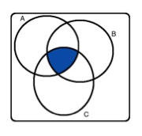

# Week 3 Practice Quiz

1. Shown below are four Venn diagrams. In which of the diagrams does the shaded area represent A and B and C?

**answer**:
<!-- -->

2. Which of the following is false about probability distributions?

**answer**: The outcomes listed must be independent.

3. Last semester, out of 170 students taking a particular statistics class, 71 students were “majoring” in social sciences and 53 students were majoring in pre-medical studies. There were 6 students who were majoring in both pre-medical studies and social sciences. What is the probability that a randomly chosen student is majoring in social sciences, given that s/he is majoring in pre-medical studies?

**answer**: 6/53

