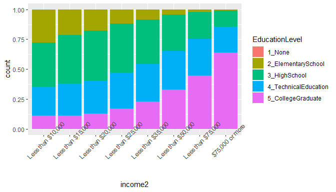

**NOTE: My native language is Spanish therefore I apologize for any writing error.**

## Setup

### Load packages


```r
library(ggplot2)
library(dplyr)
library(janitor)
library(knitr)
library(cowplot)
```

### Load data


```r
# download datasets

# my_data <- 'https://d3c33hcgiwev3.cloudfront.net/_384b2d9eda4b29131fb681b243a7767d_brfss2013.RData?Expires=1658361600&Signature=ELvDrjMy6YuCb5-g6M0wV13Bt8POjdCqKB4dkH~-KMEuJ6GjWmyEijIxlHjLYzWJfbdsj2hmqxFmGDIXOxF9eGNyJ~AzDIH0Czjd2xo9Y6BSmhec6UjwVaMpHes38WClD7gvSmr-d49MSO5aKVWlBfZTE0q44UuMBj4C1rX88S4_&Key-Pair-Id=APKAJLTNE6QMUY6HBC5A'
# 
# my_path <- file.path(getwd(), "1_Introduction_to_Probability_and_Data_with_R", 'Week_5', 'brfss2013.rdata')
# 
# download.file(url = my_data, destfile = my_path)

load(file = 'brfss2013.rdata')
```


* * *

## Part 1: Data

The observations in the sample are collected through fixed and cellular telephone interviews, related to the health of US residents, in case of fixed telephone interviews the interviewers collect data from a randomly selected adult at home. The data is collected in a way that does not interfere with the way it arises, the researchers simply observe the data obtained.

This way of data collection leads to observational studies, through which we can show an association between the explanatory variables and the response variable, but we cannot determine or conclude whether these associations are due to a causal connection, when we want to investigate the possibility of a causal connection it is usually conducted an experiment-type study.

Under the modality of observational studies the results can only be used to make correlation or association statements, these results can be generalized to the general population, this is because the subjects are randomly selected from the population, then each subject in the population It has the same probability of being selected and the resulting sample usually represents the general population.


* * *

## Part 2: Research questions

The data set compiled by The Behavioral Risk Factor Surveillance System (BRFSS) contains information on both demographic variables and variables related to chronic diseases, injuries and infectious diseases.

**Research quesion 1:**

Looking at the demographic variables, you could ask me if the income level of people is related to the educational level.

It is believed that at a higher educational level people have better employment opportunities, which allows them to access a set of benefits including a greater economic income to obtain goods and services according to the socioeconomic status they have.

**Research quesion 2:**

With regard to access to medical care, I would believe that age is related to the fact of having some health coverage, and I would expect that people who have health care coverage can afford the costs of going to the doctor.

**Research quesion 3:**

I would like to determine two characteristics that can be useful for classifying when a person can enjoy good physical health.


* * *

## Part 3: Exploratory data analysis

**Research quesion 1:**

To answer this question, I organize the information in a contingency table.

We have 8 income levels which are:

- Less than $10,000
- Less than $15,000
- Less than $20,000
- Less than $25,000
- Less than $35,000
- Less than $50,000
- Less than $75,000
- $75,000 or more

Apart there are 6 education levels, described below:

- Never attended school or only kindergarten
- Grades 1 through 8 (Elementary)
- Grades 9 though 11 (Some high school)
- Grade 12 or GED (High school graduate)
- College 1 year to 3 years (Some college or technical school)
- College 4 years or more (College graduate)

I grouped education levels into new categories as follows:

1. `1_None`: Never attended school or only kindergarten
2. `2_ElementarySchool`: Grades 1 through 8 (Elementary), Grades 9 though 11 (Some high school)
3. `3_HighSchool`: Grade 12 or GED (High school graduate)
4. `4_TechnicalEducation`: College 1 year to 3 years (Some college or technical school)
5. `5_CollegeGraduate`: College 4 years or more (College graduate)


```r
brfss2013.1 <- brfss2013[,c('income2','educa')] %>% 
  filter( !is.na(income2),!is.na(educa) ) %>% 
  mutate(
    EducationLevel = ifelse(educa == 'Never attended school or only kindergarten', '1_None',
                            ifelse(educa == 'Grades 1 through 8 (Elementary)' | 
                                     educa == 'Grades 9 though 11 (Some high school)', '2_ElementarySchool',
                                   ifelse(educa == 'Grade 12 or GED (High school graduate)', '3_HighSchool',
                                          ifelse(educa == 'College 1 year to 3 years (Some college or technical school)',
                                                 '4_TechnicalEducation', '5_CollegeGraduate') 
                                          )
                                   )
                            )
    )
```


**Contingency table (absolute frequencies)**


```r
table( brfss2013.1$income2, brfss2013.1$EducationLevel) %>% 
  kable()
```


|                  | 1_None| 2_ElementarySchool| 3_HighSchool| 4_TechnicalEducation| 5_CollegeGraduate|
|:-----------------|------:|------------------:|------------:|--------------------:|-----------------:|
|Less than $10,000 |    121|               6870|         9413|                 6104|              2873|
|Less than $15,000 |     73|               5707|        10837|                 7087|              3037|
|Less than $20,000 |     78|               6141|        14513|                 9606|              4455|
|Less than $25,000 |     50|               4936|        16999|                12510|              7165|
|Less than $35,000 |     52|               4003|        18153|                15396|             11191|
|Less than $50,000 |     31|               2520|        18857|                19798|             20249|
|Less than $75,000 |     23|               1305|        14848|                19865|             29145|
|$75,000 or more   |     28|               1291|        15040|                25651|             73800|


**Conditional distribution of income level with respect to education level**


```r
prop.table( table( brfss2013.1$income2, brfss2013.1$EducationLevel), 
            margin = 1 ) %>% 
  kable(digits = 3)
```


|                  | 1_None| 2_ElementarySchool| 3_HighSchool| 4_TechnicalEducation| 5_CollegeGraduate|
|:-----------------|------:|------------------:|------------:|--------------------:|-----------------:|
|Less than $10,000 |  0.005|              0.271|        0.371|                0.240|             0.113|
|Less than $15,000 |  0.003|              0.213|        0.405|                0.265|             0.114|
|Less than $20,000 |  0.002|              0.177|        0.417|                0.276|             0.128|
|Less than $25,000 |  0.001|              0.118|        0.408|                0.300|             0.172|
|Less than $35,000 |  0.001|              0.082|        0.372|                0.316|             0.229|
|Less than $50,000 |  0.001|              0.041|        0.307|                0.322|             0.329|
|Less than $75,000 |  0.000|              0.020|        0.228|                0.305|             0.447|
|$75,000 or more   |  0.000|              0.011|        0.130|                0.221|             0.637|


**Conditional distribution of education level with respect to income level**


```r
prop.table( table( brfss2013.1$income2, brfss2013.1$EducationLevel), 
                   margin = 2 ) %>% 
  kable(digits = 3)
```


|                  | 1_None| 2_ElementarySchool| 3_HighSchool| 4_TechnicalEducation| 5_CollegeGraduate|
|:-----------------|------:|------------------:|------------:|--------------------:|-----------------:|
|Less than $10,000 |  0.265|              0.210|        0.079|                0.053|             0.019|
|Less than $15,000 |  0.160|              0.174|        0.091|                0.061|             0.020|
|Less than $20,000 |  0.171|              0.187|        0.122|                0.083|             0.029|
|Less than $25,000 |  0.110|              0.151|        0.143|                0.108|             0.047|
|Less than $35,000 |  0.114|              0.122|        0.153|                0.133|             0.074|
|Less than $50,000 |  0.068|              0.077|        0.159|                0.171|             0.133|
|Less than $75,000 |  0.050|              0.040|        0.125|                0.171|             0.192|
|$75,000 or more   |  0.061|              0.039|        0.127|                0.221|             0.486|

It is observed that the income levels vary between the different categories of education levels, these results indicate that the two variables under consideration are associated, that is, they are dependent. Apart from the logic of the association between these two variables, it is exactly as expected, the higher the level of education, the higher the levels of income, for example, of people without any level of education, the 26% have an income less than `$ 10,000` and only 6% receive an income greater than or equal to `$ 75,000`, while people with a level of university education 1.9% have an income less than `$ 10,000` and 48% receives an income of `$ 75,000` or more.

Besides, we may be interested in knowing the distribution of the `income2` variable, usually we use relative frequencies to evaluate the distributions of the categorical variables.


```r
brfss2013.1 %>% 
  tabyl(income2) %>% 
  arrange(desc(n)) %>% 
  mutate(accumulated = cumsum(percent)) %>% 
  kable(digits = 3)
```


|income2           |      n| percent| accumulated|
|:-----------------|------:|-------:|-----------:|
|$75,000 or more   | 115810|   0.276|       0.276|
|Less than $75,000 |  65186|   0.155|       0.431|
|Less than $50,000 |  61455|   0.146|       0.578|
|Less than $35,000 |  48795|   0.116|       0.694|
|Less than $25,000 |  41660|   0.099|       0.793|
|Less than $20,000 |  34793|   0.083|       0.876|
|Less than $15,000 |  26741|   0.064|       0.940|
|Less than $10,000 |  25381|   0.060|       1.000|

We note that 57% of our data is contained in the `Less than $ 50,000`, `Less than $ 75,000` and `$ 75,000 or more` categories, with the `$ 75,000 or more` category being the most dominant with 27% of the data.

One way to visualize the two categorical variables income2 and EducationLevel would be through a segmented bar plot, these are useful to visualize frequencies of conditional distributions.


```r
brfss2013.1 %>% 
  ggplot(aes(x = income2, fill = EducationLevel)) + 
  geom_bar() + 
  theme(axis.text.x = element_text(angle = 45))
```

<!-- -->

The heights of the bars indicate the number of respondents in the different income categories and the bars are segmented by color to indicate the number of respondents by education levels.

In order to explore the relationships between these two variables I use a plot of relative frequencies.


```r
brfss2013.1 %>% 
  ggplot(aes(x = income2, fill = EducationLevel)) + 
  geom_bar(position = 'fill') + 
  theme(axis.text.x = element_text(angle = 45))
```

<!-- -->

This plot displays the percentages seen previously in the contingency table, for example, of those who earn `$ 75,000 or more`, 63% have a level of university education.


**Research quesion 2:**

For this question, I select the following variables:

- `hlthpln1`: Have Any Health Care Coverage
- `medcost`: Could Not See Dr. Because Of Cost
- `X_age80`: Imputed Age Value Collapsed Above 80

To know the distribution of the variable age, I visualize through a histogram the variable `X_age80`, apart I observe the association that can emerge between age and have a medical care coverage.


```r
brfss2013.2 <- brfss2013[,c('hlthpln1','X_age80','medcost')] %>% 
  filter( !is.na(hlthpln1), !is.na(X_age80), !is.na(medcost), X_age80 > 18)

brfss2013.2 %>% 
  ggplot(aes(x = X_age80, fill = hlthpln1)) + 
  geom_histogram(bins = 10)
```

<!-- -->

The age distribution seems to be unimodal with some peaks between 60 and 65 years, as for the relationship that may exist between age and having medical care coverage, it is not possible to appreciate well with this plot, however, it seems that after 65 years, people are likely to have health coverage. To better appreciate this association, I use a relative frequencies plot segmented by having health coverage.


```r
brfss2013.2$age_range <- cut(x = brfss2013.2$X_age80, 
                             breaks = quantile(x = brfss2013.2$X_age80, seq(0, 1, .1)), 
                             include.lowest = T)

brfss2013.2 %>% 
  ggplot(aes(x = age_range, fill = hlthpln1)) + 
  geom_bar(position = 'fill') + 
  theme( axis.text.x = element_text(angle = 45) )
```

<!-- -->


Indeed it is observed that at a higher age the percentage of people with medical care coverage is higher, reflecting that from 66 years of age or older the possibility that a person does not have health coverage is very low, this relationship is logical, At a younger age, people are expected to be in good health and as they get older, people choose to acquire health coverage as a precaution to be more vulnerable to suffer from an illness and they also tend to have greater financial stability that allows them to pay a sure.

On the other hand we want to see if people with medical care coverage can attend the doctor because they have a health coverage that covers medical expenses, we summarize this information in a contingency table.


```r
brfss2013.2$health_coverage <- ifelse(brfss2013.2$hlthpln1 == 'Yes', 
                                      'HasCoverage', 'NoCoverage')
```

**Absolute frequencies**


```r
table(brfss2013.2$health_coverage, brfss2013.2$medcost)
```

```
##              
##                  Yes     No
##   HasCoverage  34699 396122
##   NoCoverage   24867  29593
```


**Conditional distribution of having medical coverage regarding not being able to go to the doctor for the cost**


```r
prop.table(table(brfss2013.2$health_coverage, brfss2013.2$medcost),
           margin = 1) %>% 
  round(2)
```

```
##              
##                Yes   No
##   HasCoverage 0.08 0.92
##   NoCoverage  0.46 0.54
```

```r
brfss2013.2 %>% 
  ggplot(aes(x = health_coverage, fill = medcost)) + 
  geom_bar(position = 'fill')
```

<!-- -->

The results obtained indicate a relationship between these two variables since there is a difference when you have a health coverage. It is observed that people who have a health coverage 92% of them can attend the doctor while 8% cannot attend the doctor since they do not have the necessary resources or a health coverage that can afford medical expenses, when people do not have health coverage the percentage of being able to attend the doctor is more uniform with 46% who do not have the resources to attend the doctor and 56% who can afford to visit the doctor.


**Research quesion 3:**

Two characteristics that I consider to be useful for determining when a person is in good health would be:

- `physhlth`: Number Of Days Physical Health Not Good
- `drvisits`: Doctor Visits Past 12 Months

In this case my dependent variable or response variable would be: `genhlth`, being a categorical variable with 5 levels which are:

- Excellent
- Very good
- Good
- Fair
- Poor

It can be thought that a person with an excellent, Very good, Good and Fair state of health generally enjoys good health, while a person with a Poor state of health has a poor state of health, therefore I create a binary variable called `health_condition` in which I generalize the state of health in two categories "Good" and "Bad".


```r
brfss2013.3 <- brfss2013[, c('physhlth','drvisits','genhlth')] %>% 
  na.omit()


brfss2013.3$health_condition <- factor(ifelse(brfss2013.3$genhlth != 'Poor', 
                                              'Good', 'Bad'))
```


I visualize the `drvisits` and `physhlth` variables in a scatter plot segmented by the `HealthCondition` dependent variable, to see if it is possible to obtain a separation between the two classes of the response variable through these two variables.


```r
brfss2013.3 %>% 
  ggplot(aes(x = drvisits, y = physhlth, colour = health_condition)) + 
  geom_point()
```

<!-- -->

In general, people with a bad state of health concentrate on the high values of the variable `physhlth`, however there is no clear trend that allows us to make a separation between people with good or bad health.

It is believed that the number of days that health is not good `physhlth` and visits to the doctor in the last twelve months `drvisits` affects the physical health status of the person `HealthCondition`, for this we observe the central measures and measures of dispersion of the variables `physhlth` and `drvisits` in relation to the physical health of the person.


```r
my_split <- split(x = brfss2013.3, f = brfss2013.3$health_condition) 

lapply(
  X = my_split, 
  function(x){
    c(mean(x$physhlth),
      median(x$physhlth),
      sd(x$physhlth), 
      mean(x$drvisits),
      median(x$drvisits),
      sd(x$drvisits)) -> my_vector
    
    matrix(data = my_vector, nrow = 3, ncol = 2, 
         dimnames = list(c('mean', 'median', 'standard_desv'), 
                         c('physhlth', 'drvisits') ) ) 
    }
  )
```

```
## $Bad
##               physhlth drvisits
## mean          22.99188 12.87711
## median        30.00000  8.00000
## standard_desv 10.29225 14.94994
## 
## $Good
##               physhlth drvisits
## mean          3.205142 4.808481
## median        0.000000 3.000000
## standard_desv 7.325278 7.549206
```

```r
plot1 <- ggplot(data = brfss2013.3, aes(x=physhlth)) + 
  geom_histogram(binwidth = 5)

plot2 <- ggplot(data = brfss2013.3, aes(x=drvisits)) + 
  geom_histogram(binwidth = 5)

plot3 <- ggplot(data = brfss2013.3, aes(x = health_condition, y = physhlth)) +
  geom_boxplot()

plot4 <-ggplot(data = brfss2013.3, aes(x = health_condition, y = drvisits)) +
  geom_boxplot()

plot_grid( plot1, plot2, plot3, plot4 )
```

<!-- -->

The distribution of the variables `physhlth` and `drvisits` is skewed to the right, apart the dispersion and central measures of the variables `physhlth` and `drvisits` vary between the categories of physical health status of people, it can be said that the `health_condition` variable is associated with the `physhlth` and `drvisits` variables.
