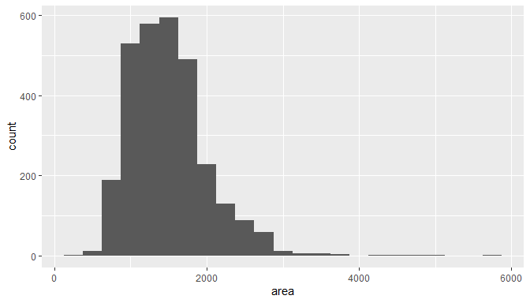
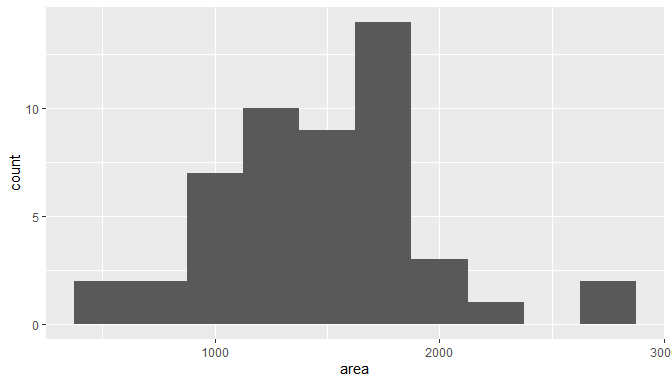
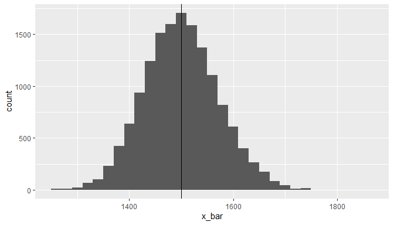
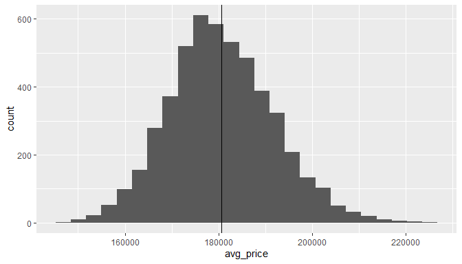
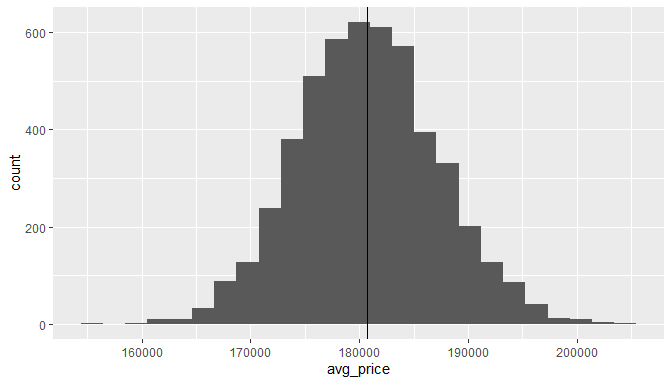
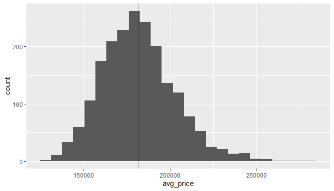
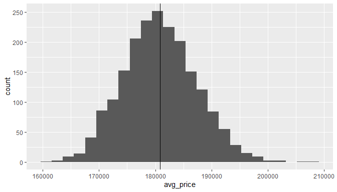

::: instructions
Complete all **Exercises**, and submit answers to **Questions** on the
Coursera platform.
:::

## Getting Started

### Load packages

In this lab we will explore the data using the `dplyr` package and
visualize it using the `ggplot2` package for data visualization. The
data can be found in the companion package for this course, `statsr`.

Let's load the packages.


```r
library(statsr)
```

```
## Warning: package 'statsr' was built under R version 4.1.3
```

```
## Warning: package 'BayesFactor' was built under R version 4.1.3
```

```
## Warning: package 'coda' was built under R version 4.1.3
```

```r
library(dplyr)
```

```
## Warning: package 'dplyr' was built under R version 4.1.3
```

```r
library(ggplot2)
```

### The data

We consider real estate data from the city of Ames, Iowa. The details of
every real estate transaction in Ames is recorded by the City Assessor's
office. Our particular focus for this lab will be all residential home
sales in Ames between 2006 and 2010. This collection represents our
population of interest. In this lab we would like to learn about these
home sales by taking smaller samples from the full population. Let's
load the data.


```r
data(ames)
```

We see that there are quite a few variables in the data set, enough to
do a very in-depth analysis. For this lab, we'll restrict our attention
to just two of the variables: the above ground living area of the house
in square feet (`area`) and the sale price (`price`).

We can explore the distribution of areas of homes in the population of
home sales visually and with summary statistics. Let's first create a
visualization, a histogram:


```r
ggplot(data = ames, aes(x = area)) +
  geom_histogram(binwidth = 250)
```

<!-- -->

Let's also obtain some summary statistics. Note that we can do this
using the `summarise` function. We can calculate as many statistics as
we want using this function, and just string along the results. Some of
the functions below should be self explanatory (like `mean`, `median`,
`sd`, `IQR`, `min`, and `max`). A new function here is the `quantile`
function which we can use to calculate values corresponding to specific
percentile cutoffs in the distribution. For example `quantile(x, 0.25)`
will yield the cutoff value for the 25th percentile (Q1) in the
distribution of x. Finding these values are useful for describing the
distribution, as we can use them for descriptions like *"the middle 50%
of the homes have areas between such and such square feet"*.


```r
ames %>%
  summarise(mu = mean(area), pop_med = median(area), 
            sigma = sd(area), pop_iqr = IQR(area),
            pop_min = min(area), pop_max = max(area),
            pop_q1 = quantile(area, 0.25),  # first quartile, 25th percentile
            pop_q3 = quantile(area, 0.75))  # third quartile, 75th percentile
```

```
## # A tibble: 1 x 8
##      mu pop_med sigma pop_iqr pop_min pop_max pop_q1 pop_q3
##   <dbl>   <dbl> <dbl>   <dbl>   <int>   <int>  <dbl>  <dbl>
## 1 1500.    1442  506.    617.     334    5642   1126  1743.
```

::: question
Which of the following is **false**?

-   The distribution of areas of houses in Ames is unimodal and
    right-skewed.
-   **Answer:** 50% of houses in Ames are smaller than 1,499.69 square
    feet.
-   The middle 50% of the houses range between approximately 1,126
    square feet and 1,742.7 square feet.
-   The IQR is approximately 616.7 square feet.
-   The smallest house is 334 square feet and the largest is 5,642
    square feet.
:::

## The unknown sampling distribution

In this lab we have access to the entire population, but this is rarely
the case in real life. Gathering information on an entire population is
often extremely costly or impossible. Because of this, we often take a
sample of the population and use that to understand the properties of
the population.

If we were interested in estimating the mean living area in Ames based
on a sample, we can use the following command to survey the population.


```r
samp1 <- ames %>%
  sample_n(size = 50)
```

This command collects a simple random sample of `size` 50 from the
`ames` dataset, which is assigned to `samp1`. This is like going into
the City Assessor's database and pulling up the files on 50 random home
sales. Working with these 50 files would be considerably simpler than
working with all 2930 home sales.

::: exercise
Describe the distribution of this sample? How does it compare to the
distribution of the population? **Hint:** `sample_n` function takes a
random sample of observations (i.e. rows) from the dataset, you can
still refer to the variables in the dataset with the same names. Code
you used in the previous exercise will also be helpful for visualizing
and summarizing the sample, however be careful to not label values `mu`
and `sigma` anymore since these are sample statistics, not population
parameters. You can customize the labels of any of the statistics to
indicate that these come from the sample.
:::


```r
# type your code for the Exercise here, and Run Document
samp1 %>% 
  ggplot(aes(x = area)) + 
  geom_histogram(binwidth = 250)
```

<!-- -->

```r
summary(samp1$area)
```

```
##    Min. 1st Qu.  Median    Mean 3rd Qu.    Max. 
##     492    1181    1518    1475    1724    2687
```

If we're interested in estimating the average living area in homes in
Ames using the sample, our best single guess is the sample mean.


```r
samp1 %>%
  summarise(x_bar = mean(area))
```

```
## # A tibble: 1 x 1
##   x_bar
##   <dbl>
## 1 1475.
```

Depending on which 50 homes you selected, your estimate could be a bit
above or a bit below the true population mean of 1,499.69 square feet.
In general, though, the sample mean turns out to be a pretty good
estimate of the average living area, and we were able to get it by
sampling less than 3% of the population.

::: question
Suppose we took two more samples, one of size 100 and one of size 1000.
Which would you think would provide a more accurate estimate of the
population mean?

-   Sample size of 50.
-   Sample size of 100.
-   **Answer:** Sample size of 1000.
:::

Let's take one more sample of size 50, and view the mean area in this
sample:


```r
ames %>%
  sample_n(size = 50) %>%
  summarise(x_bar = mean(area))
```

```
## # A tibble: 1 x 1
##   x_bar
##   <dbl>
## 1 1571.
```

Not surprisingly, every time we take another random sample, we get a
different sample mean. It's useful to get a sense of just how much
variability we should expect when estimating the population mean this
way. The distribution of sample means, called the *sampling
distribution*, can help us understand this variability. In this lab,
because we have access to the population, we can build up the sampling
distribution for the sample mean by repeating the above steps many
times. Here we will generate 15,000 samples and compute the sample mean
of each. Note that we are sampling with replacement, `replace = TRUE`
since sampling distributions are constructed with sampling with
replacement.


```r
sample_means50 <- ames %>%
                    rep_sample_n(size = 50, reps = 15000, replace = TRUE) %>%
                    summarise(x_bar = mean(area))

ggplot(data = sample_means50, aes(x = x_bar)) +
  geom_histogram(binwidth = 20)
```

<!-- -->

Here we use R to take 15,000 samples of size 50 from the population,
calculate the mean of each sample, and store each result in a vector
called `sample_means50`. Next, we review how this set of code works.

::: exercise
How many elements are there in `sample_means50`? Describe the sampling
distribution, and be sure to specifically note its center. Make sure to
include a plot of the distribution in your answer.
:::


```r
# type your code for the Exercise here, and Run Document
ggplot(data = sample_means50, aes(x = x_bar)) +
  geom_histogram(binwidth = 20) + 
  geom_vline(xintercept = mean(sample_means50$x_bar))
```

<!-- -->

```r
summary(sample_means50$x_bar)
```

```
##    Min. 1st Qu.  Median    Mean 3rd Qu.    Max. 
##    1250    1451    1498    1500    1547    1856
```

## Interlude: Sampling distributions

The idea behind the `rep_sample_n` function is *repetition*. Earlier we
took a single sample of size `n` (50) from the population of all houses
in Ames. With this new function we are able to repeat this sampling
procedure `rep` times in order to build a distribution of a series of
sample statistics, which is called the **sampling distribution**.

Note that in practice one rarely gets to build sampling distributions,
because we rarely have access to data from the entire population.

Without the `rep_sample_n` function, this would be painful. We would
have to manually run the following code 15,000 times


```r
ames %>%
  sample_n(size = 50) %>%
  summarise(x_bar = mean(area))
```

as well as store the resulting sample means each time in a separate
vector.

Note that for each of the 15,000 times we computed a mean, we did so
from a **different** sample!

::: exercise
To make sure you understand how sampling distributions are built, and
exactly what the `sample_n` and `do` function do, try modifying the code
to create a sampling distribution of **25 sample means** from **samples
of size 10**, and put them in a data frame named `sample_means_small`.
Print the output. How many observations are there in this object called
`sample_means_small`? What does each observation represent?
:::


```r
# type your code for the Exercise here, and Run Document
sample_means_small <- rep_sample_n(tbl = ames, size = 10, replace = T, reps = 25) %>% 
  summarise(x_bar = mean(area))

sample_means_small
```

```
## # A tibble: 25 x 2
##    replicate x_bar
##        <int> <dbl>
##  1         1 1303.
##  2         2 1522.
##  3         3 1690.
##  4         4 1629.
##  5         5 1615 
##  6         6 1314.
##  7         7 1462.
##  8         8 1491.
##  9         9 1456.
## 10        10 1363.
## # ... with 15 more rows
```

::: question
How many elements are there in this object called `sample_means_small`?

-   0
-   3
-   **Answer:** 25
-   100
-   5,000
:::


```r
# type your code for Question 3 here, and Run Document
nrow(sample_means_small) # row number contained in the object called sample_means_small
```

```
## [1] 25
```

::: question
Which of the following is **true** about the elements in the sampling
distributions you created?

-   **Answer:** Each element represents a mean square footage from a
    simple random sample of 10 houses.
-   Each element represents the square footage of a house.
-   Each element represents the true population mean of square footage
    of houses.
:::

## Sample size and the sampling distribution

Mechanics aside, let's return to the reason we used the `rep_sample_n`
function: to compute a sampling distribution, specifically, this one.


```r
ggplot(data = sample_means50, aes(x = x_bar)) +
  geom_histogram(binwidth = 20)
```

<!-- -->

The sampling distribution that we computed tells us much about
estimating the average living area in homes in Ames. Because the sample
mean is an unbiased estimator, the sampling distribution is centered at
the true average living area of the population, and the spread of the
distribution indicates how much variability is induced by sampling only
50 home sales.

In the remainder of this section we will work on getting a sense of the
effect that sample size has on our sampling distribution.

::: exercise
Use the app below to create sampling distributions of means of `area`s
from samples of size 10, 50, and 100. Use 5,000 simulations. What does
each observation in the sampling distribution represent? How does the
mean, standard error, and shape of the sampling distribution change as
the sample size increases? How (if at all) do these values change if you
increase the number of simulations? (Note: if the app below doesn't
display properly when you Run the Document, try running the code chunk
individually by clicking on the green arrow.)
:::


::: question
It makes intuitive sense that as the sample size increases, the center
of the sampling distribution becomes a more reliable estimate for the
true population mean. Also as the sample size increases, the variability
of the sampling distribution \_\_\_\_\_\_\_\_.

-   **Answer:** decreases
-   increases
-   stays the same
:::

::: exercise
Take a random sample of size 50 from `price`. Using this sample, what is
your best point estimate of the population mean?
:::


```r
# type your code for this Exercise here, and Run Document
ames %>% 
  sample_n(size = 50) %>% 
  summarise(avg = mean(price))
```

```
## # A tibble: 1 x 1
##       avg
##     <dbl>
## 1 188502.
```

::: exercise
Since you have access to the population, simulate the sampling
distribution for $\bar{x}_{price}$ by taking 5000 samples from the
population of size 50 and computing 5000 sample means. Store these means
in a vector called `sample_means50`. Plot the data, then describe the
shape of this sampling distribution. Based on this sampling
distribution, what would you guess the mean home price of the population
to be?
:::


```r
# type your code for this Exercise here, and Run Document
sample_means50 <- rep_sample_n(tbl = ames, size = 50, replace = T, reps = 5000) %>% 
  summarise(avg_price = mean(price))

sample_means50 %>% 
  ggplot(aes(x = avg_price)) +
  geom_histogram(bins = 25) + 
  geom_vline(xintercept = mean(sample_means50$avg_price))
```

<!-- -->

::: exercise
Change your sample size from 50 to 150, then compute the sampling
distribution using the same method as above, and store these means in a
new vector called `sample_means150`. Describe the shape of this sampling
distribution, and compare it to the sampling distribution for a sample
size of 50. Based on this sampling distribution, what would you guess to
be the mean sale price of homes in Ames?
:::


```r
# type your code for this Exercise here, and Run Document
sample_means150 <- rep_sample_n(tbl = ames, size = 150, replace = T, reps = 5000) %>% 
  summarise(avg_price = mean(price))

sample_means150 %>% 
  ggplot(aes(x = avg_price)) +
  geom_histogram(bins = 25) + 
  geom_vline(xintercept = mean(sample_means150$avg_price))
```

<!-- -->

------------------------------------------------------------------------

So far, we have only focused on estimating the mean living area in homes
in Ames. Now you'll try to estimate the mean home price.

Note that while you might be able to answer some of these questions
using the app you are expected to write the required code and produce
the necessary plots and summary statistics. You are welcomed to use the
app for exploration.

::: exercise
Take a sample of size 15 from the population and calculate the mean
`price` of the homes in this sample. Using this sample, what is your
best point estimate of the population mean of prices of homes?
:::


```r
# type your code for this Exercise here, and Run Document
ames %>% 
  sample_n(size = 15) %>% 
  summarise(avr_price = mean(price))
```

```
## # A tibble: 1 x 1
##   avr_price
##       <dbl>
## 1    185360
```

::: exercise
Since you have access to the population, simulate the sampling
distribution for $\bar{x}_{price}$ by taking 2000 samples from the
population of size 15 and computing 2000 sample means. Store these means
in a vector called `sample_means15`. Plot the data, then describe the
shape of this sampling distribution. Based on this sampling
distribution, what would you guess the mean home price of the population
to be? Finally, calculate and report the population mean.
:::


```r
# type your code for this Exercise here, and Run Document
sample_means15 <- ames %>% 
  rep_sample_n(size = 15, replace = T, reps = 2000) %>% 
  summarise(avg_price = mean(price))

sample_means15 %>% 
  ggplot(aes(x = avg_price)) + 
  geom_histogram(bins = 25) + 
  geom_vline(xintercept = mean(sample_means15$avg_price))
```

<!-- -->

::: exercise
Change your sample size from 15 to 150, then compute the sampling
distribution using the same method as above, and store these means in a
new vector called `sample_means150`. Describe the shape of this sampling
distribution, and compare it to the sampling distribution for a sample
size of 15. Based on this sampling distribution, what would you guess to
be the mean sale price of homes in Ames?
:::


```r
# type your code for this Exercise here, and Run Document
sample_means150 <- ames %>% 
  rep_sample_n(size = 150, replace = T, reps = 2000) %>% 
  summarise(avg_price = mean(price))

sample_means150 %>% 
  ggplot(aes(x = avg_price)) + 
  geom_histogram(bins = 25) + 
  geom_vline(xintercept = mean(sample_means150$avg_price))
```

<!-- -->

::: question
Which of the following is false?

-   **Answer:** The variability of the sampling distribution with the
    smaller sample size (`sample_means50`) is smaller than the
    variability of the sampling distribution with the larger sample size
    (`sample_means150`).
-   The means for the two sampling distribtuions are roughly similar.\
-   Both sampling distributions are symmetric.
:::


```r
# type your code for Question 6 here, and Run Document
my_means <- list('sample_means50' = sample_means50,
                 'sample_means150' = sample_means150)

lapply(X = my_means, 
       function(x){
         sd(x$avg_price)/sqrt(length(x$avg_price))
         })
```

```
## $sample_means50
## [1] 157.7215
## 
## $sample_means150
## [1] 144.8216
```

::: {#license}
This is a derivative of an
[OpenIntro](https://www.openintro.org/stat/labs.php) lab, and is
released under a [Attribution-NonCommercial-ShareAlike 3.0 United
States](https://creativecommons.org/licenses/by-nc-sa/3.0/us/) license.
:::
