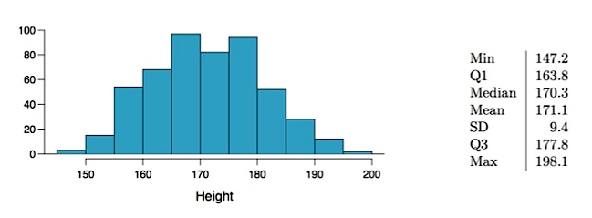

# Week 1 Quiz

1. Researchers studying anthropometry collected body girth measurements and skeletal diameter measurements, as well as age, weight, height and gender, for 507 physically active individuals. The histogram below shows the sample distribution of heights in centimeters, and the table shows sample statistics calculated based on this sample.  Which of the following is **not necessarily true**?

<!-- -->

**Answer:** The population mean is 171.1 cm.

2. Which of the following is **false**?

**Answer:** In order to reduce the standard error by half, sample size should be doubled.

3. Students are asked to count the number of chocolate chips in 22 cookies for a class activity. They found that the cookies on average had 14.77 chocolate chips with a standard deviation of 4.37 chocolate chips. After collecting the data, a student reports the standard error of the mean to be 0.93 chocolate chips. What is the **best** way to interpret the student’s result?

**Answer:** 0.93 chocolate chips is a measure of the variability we’d expect in calculations of the mean number of chocolate chips if we took repeated random samples of 22 cookies.

4. Suppose you took a large number of random samples of size n from a large population and calculated the mean of each sample. Then suppose you plotted the distribution of your sample means in a histogram. Now consider the following possible attributes of your collected data and the population from which they were sampled. For which of the following sets of attributes would you not expect your histogram of your sample means to follow a nearly normal distribution?

**Answer:** *n = 10*. The population distribution is unknown, but the distribution of data in each sample is heavily skewed.

5. A random sample of 100 runners who completed the 2012 Cherry Blossom 10 mile run yielded an average completion time of 95 minutes. A 95% confidence interval calculated based on this sample is 92 minutes to 98 minutes. Which of the following is false based on this confidence interval?

**Answer:** 95% of the time the true average finishing time of all runners who completed the 2012 Cherry Blossom 10 mile run is between 92 minutes and 98 minutes.

6. All but one of the following confidence intervals has a margin of error of 0.7. Which is the confidence interval with the different margin of error?

**Answer:** (1.6,4.4)

7. A company offering online speed reading courses claims that students who take their courses show a 5 times (500%) increase in the number of words they can read in a minute without losing comprehension. A random sample of 100 students yielded an average increase of 415% with a standard deviation of 220%.

Calculate a 95% confidence interval for the average increase in number of words students can read in a minute without losing comprehension. Choose the closest answer.

**Answer:** (371.88, 458.12)