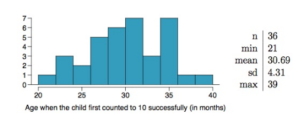

# Week 2 Quiz

1. A study suggests that the average college student spends 2 hours per 
week communicating with others online. You believe that this is an 
underestimate and decide to collect your own sample for a hypothesis 
test. You randomly sample 60 students from your dorm and find that on 
average they spent 3.5 hours a week communicating with others online. 
Which of the following is the correct set of hypotheses for this 
scenario?

**Answer:** $H\0: \mu  =  2, H\A: \mu  >  2$

2. Which of the following is the correct definition of the p-value? 

**Answer:** P(observed or more extreme sample statistic | $H\0$ true)

3. Two-sided alternative hypotheses are phrased in terms of:

**Answer:** $\neq$

4. You set up a two-sided hypothesis test for a population mean $\mu$ with a null hypothesis of $H\0: \mu = 100$. You chose a significance level of $\alpha = 0.05$. The p-value calculated from the data is 0.12, and hence you failed to reject the null hypothesis. Suppose that after your analysis was completed and published, an expert informed you that the true value of $\mu$ is 104. How would you describe the result of your analysis?

**Answer:** A Type 2 error was made because you failed to reject the null hypothesis but $\mu$ is really not equal to 100.

5. A statistician is studying blood pressure levels of Italians in the age range 75-80. The following is some information about her study:

1. The data were collected by responses to a survey conducted by email, and no measures were taken to get information from those who did not respond to the initial survey email.

2. The sample observations only make up about 4% of the population.

3. The sample size is 2,047.

4. The distribution of sample observations is skewed - the skew is easy to see, although not very extreme.

The researcher is ready to use the Central Limit Theorem (CLT) in the main part of her analysis. Which aspect of the her study is most likely to prevent her from using the CLT?

**Answer:** (I), because the sample may not be random and hence observations may not be independent.

6. SAT scores are distributed with a mean of 1,500 and a standard deviation of 300. You are interested in estimating the average SAT score of first year students at your college. If you would like to limit the margin of error of your 98% confidence interval to 40 points, at least how many students should you sample?

**Answer:** 306

7. If it’s relatively riskier to reject the null hypothesis when it might be true, should a smaller or a larger significance level be used?

**Answer:** smaller

8. Researchers investigating characteristics of gifted children 
collected data from schools in a large city on a random sample of 
thirty-six children who were identified as gifted children soon after 
they reached the age of four. The following histogram shows the 
distribution of the ages (in months) at which these children first 
counted to 10 successfully. Also provided are some sample statistics.

Suppose you read online that children first count to 10 successfully when they 
are 32 months old, on average. You perform a hypothesis test evaluating 
whether the average age at which gifted children first count to 10 is 
different than the general average of 32 months. What is the p-value of 
the hypothesis test? Choose the closest answer.

<!-- -->

**Answer:** 0.0688